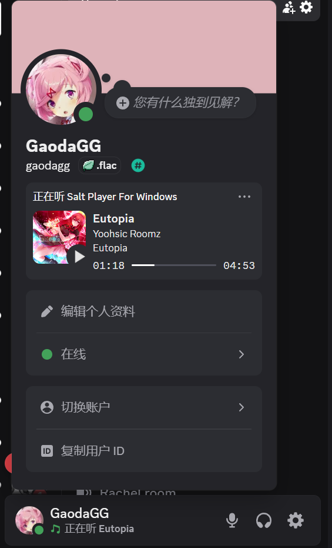

# 增加 SPW Discord丰富状态的插件
## 用法:
1. 在 SPW 设置 → 创意工坊 → 模组管理 → 右上角导入模组 → 选择 `Discord_Rich_Presence.zip`
2. 配置插件
3. 启用并享受它

## 效果

## 封面获取顺序
### **Cloudflare R2 > 网易云 > QQ音乐 > 酷狗音乐**

## R2配置指南
[Cloudflare R2 配置指南](./CLOUDFLARE_R2_SETUP.md)
# **不需要解压!!**

## Discord出现两个SPW的解决方法
Discord左下角用户设置 - 注册游戏 把SPW给毙了

## 其他插件:
[Steam 丰富状态扩展](https://github.com/GaodaGG/SaltSteamPlugin)

[临时SPW全屏窗口插件](https://github.com/GaodaGG/SaltFullPlugin)

## 致谢
* **SaltLyricPlugin** 
    [https://github.com/zmxlsss666/SaltLyricPlugin/](https://github.com/zmxlsss666/SaltLyricPlugin/)
    
    该插件获取封面Url相关代码参考自该项目

    许可证：[Apache License 2.0](https://github.com/Moriafly/spw-workshop-api/blob/main/LICENSE)
* **Discord-RPC**
    [https://github.com/JnCrMx/discord-game-sdk4j](https://github.com/JnCrMx/discord-game-sdk4j)

    该项目的Discord Rich Presence Java封装库

    许可证：[MIT License](https://github.com/JnCrMx/discord-game-sdk4j/blob/master/LICENSE)
